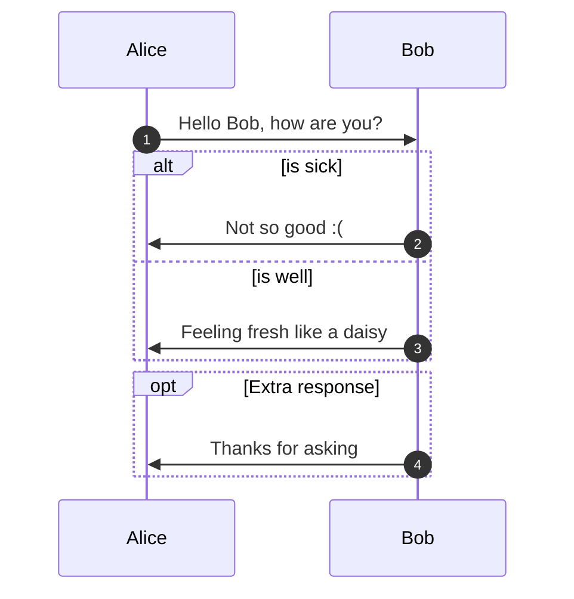
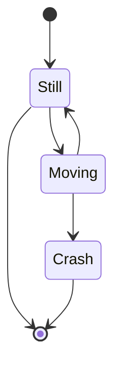

# Sample Sequence Diagrams

Using [MermaidJs](https://mermaid-js.github.io/mermaid/#/)

## Sequence Diagrams

```mermaid
  sequenceDiagram
    autonumber
    Alice->>Bob: Hello Bob, how are you?
    alt is sick
        Bob->>Alice: Not so good :(
    else is well
        Bob->>Alice: Feeling fresh like a daisy
    end
    opt Extra response
        Bob->>Alice: Thanks for asking
    end
```

## State Diagrams

```mermaid
stateDiagram-v2
  [*] --> Still
  Still --> [*]

  Still --> Moving
  Moving --> Still
  Moving --> Crash
  Crash --> [*]
```
